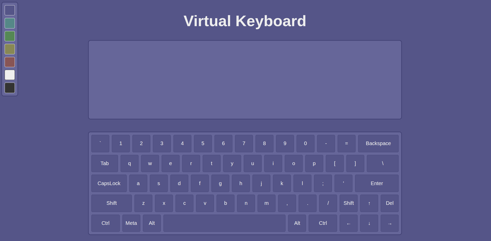

# 🎹 Virtual Keyboard on JS

Легкая, интерактивная и отзывчивая виртуальная клавиатура, написанная на чистом JavaScript (Vanilla JS), HTML5 и CSS3. Отлично подходит в качестве готового UI-компонента для терминалов, веб-киосков или пет-проектов.

## 🚀 Живое демо (Live Demo)

Вы можете протестировать работу виртуальной клавиатуры прямо в браузере:
👉 **[Открыть Virtual Keyboard](https://na1x-dev.github.io/virtual-keyboard/)**

---

## 📸 Скриншот интерфейса

<div align="center">
  
  <p><i>Интерфейс виртуальной клавиатуры в браузере</i></p>
</div>

---

## ✨ Особенности / Функционал
* 💻 **Чистый код:** Написано без использования сторонних библиотек и фреймворков (No jQuery, No React).
* 📱 **Адаптивный дизайн:** Корректно отображается как на мониторах, так и на мобильных устройствах.
* ⌨️ **Интерактивность:** Поддержка кликов мыши/тач-событий с визуальным откликом нажатия клавиш.
* 🎨 **Легкая кастомизация:** Стили вынесены в отдельный CSS-файл, что позволяет быстро менять темы оформления.

---

## 🛠️ Стек технологий
* **HTML5** — семантическая разметка клавиатуры.
* **CSS3** — стилизация, Flexbox/Grid-сетка, анимации нажатия кнопок.
* **JavaScript (ES6+)** — логика обработки ввода, генерация символов и управление состоянием.

---

## 📦 Как запустить проект локально

Вам не нужно ничего устанавливать через `npm`. Достаточно просто клонировать репозиторий и открыть файл в браузере.

1. Клонируйте репозиторий:
   ```bash
   git clone https://github.com/Na1x-dev/virtual-keyboard
   ```
2. Перейдите в папку с проектом:
   ```bash
   cd virtual-keyboard
   ```
3. Откройте файл `index.html` в любом современном браузере (Chrome, Firefox, Edge, Safari):
   * Двойным кликом по файлу.
   * Или используя расширение *Live Server* в VS Code для локального хостинга.

---

## 📂 Структура проекта
```text
virtual-keyboard/
├── index.html   # Основная структура и контейнер для клавиатуры
├── style.css    # Стили оформления, адаптивность и анимации
├── main.js     # Логика работы: отслеживание событий и вывод текста
└── README.md    # Документация проекта
```

---

## 🤝 Лицензия
Этот проект распространяется под лицензией MIT. Вы можете свободно использовать его в личных и коммерческих целях.
